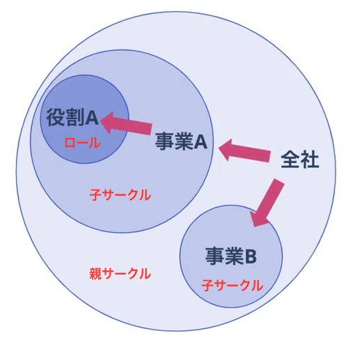
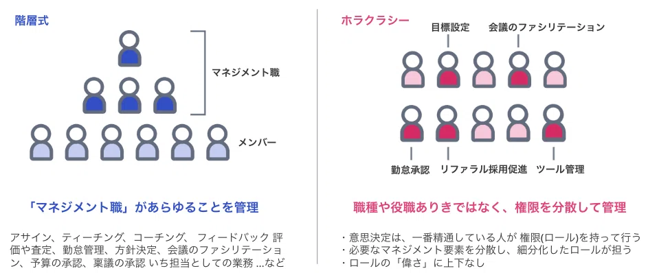

# マネージャー不在の組織は機能するのか？
## 元VPoEから見たUbieの実態

### Ubie株式会社
橋山 牧人

---
# 自己紹介

### 略歴
- 橋山 牧人 / [@hashiyaman](https://twitter.com/hashiyaman)
- Engineering Organization Lead @Ubie
- これまで: EM/VPoE として10年以上の経験
  - 楽天グループ: お買い物かごシステムの開発・運用
  - OLTA: 開発組織のマネジメント全般、採用・評価制度の設計

### Ubie入社の理由
- ホラクラシーによるマネージャー不在の組織運営、評価と報酬を切り離す仕組みがどのようにワークしているか興味があったため

---
# ホラクラシー組織とは

ホラクラシーは、従来の階層型組織構造とは異なる組織運営モデルである。

ロール・サークルの階層構造を示した図

### 重要な特徴
- 意思決定や権限を、個人ではなく役割（ロール）に紐づけ分散させる
- **階層構造を持つ**組織であり、完全なフラットではない

---
# ホラクラシー組織における意思決定の仕組み

従来の階層型組織では、多くの承認プロセスが組織のボトルネックとなっていた。
ホラクラシーでは、各ロールが課題解決の責任と権限を持つため迅速な判断が可能。

| 従来の階層型組織 | ホラクラシー組織 |
|:--|:--|
| マネージャーに相談 | 関係者に直接相談 |
| マネージャー経由で調整 | 担当者が優先順位を判断 |
| 承認後に実施 | 特別な承認なく実施 |

---
# Ubieにおけるマネジメントのやり方

1. リソースアサインメント

2. 人材開発（目標設定・フィードバック）

---
# リソースアサインメント

四半期ごとのOKRを基準に、各サークル内で優先順位とリソースを決定する。
この時、必要に応じてサークルやロールの組織構造（ガバナンス*1）を再編成する。

| プロセス | 階層型組織 | ホラクラシー組織（Ubie） |
|:--|:--|:--|
| OKRの決定 | マネージャーが実施 | ・担当サークル、ロールが実施 |
| 組織構造の決定 | マネージャーが実施 | ・サークルリード(*2)、担当ロールが実施 |
| 優先順位の決定 | マネージャー・POが実施 | ・サークルリード、担当ロールが実施 |
| リソースアサイン | ・マネージャー間で相談 ・上位マネージャーの承認 | ・担当サークル・ロール間で相談 ・専用サークル・ロールがサポート ・既定の周知プロセスで承認 |

*1 ホラクラシー用語。サークルの責任・権限の範囲、所属するロールや会議体などのコミュニケーション設計などを意味する。
*2 役割の割り当てやリソース管理の責任を持つが、**メンバーへの直接的な命令権はない**ところがマネージャーとの違いである。

---
# リソースアサインメントの実例

（例）OKRを推進するための新規開発を行うチームの組成

| プロセス | 階層型組織（前職まで） | ホラクラシー組織（Ubie） |
|:--|:--|:--|
| チーム組成 | - 自分が必要なスキル・チーム構成を検討する - 各チームと調整しながらメンバーをアサインする | - 適任者が自主的にロール・サークルを作りリードになる - 必要なメンバーを他サークル・ロールと調整して集める |
| リソース調整 | - 必要に応じ他チームからの異動や新規採用を検討する - **最終決定権はマネージャー（自分）が保持** | - 自分は候補提案や交渉をサポートする - **最終判断はロール同士・サークル同士で決定** |

---
# 人材開発（目標設定・フィードバック）

評価を報酬と切り離しつつ、**Self-Development Policy** に基づき、社員自身が能力開発の主体となる目標設定とフィードバックの仕組みを導入している。

| プロセス | 階層型組織 | ホラクラシー組織（Ubie） |
|:--|:--|:--|
| 目標設定 | マネージャーが主導 | ・メンバーが事業戦略やOKRをもとに自ら決定 ・U-map(*1)を参考に伸ばすべき能力を設定 |
| 評価・フィードバック | マネージャーが一元的に実施 | ・伴走ペア(*2)による定期的なフィードバック |
| 能力開発支援 | マネージャーとHRが担当 | ・専門のロール、サークルを各部署に設置 ・サポート機能を伴奏ペア、担当ロールで分散 |

*1 個人の役割と進化の方向性を明確化するスキルマップ。事業のフェーズや役割に応じて複数の分類が定められている。
*2 人材開発のロールを担い、同じサークルに所属する経験者。U-mapにおいて「戦略策定・操舵力」に強みを持つ。

---
# 人材開発の実例

（例）エンジニアの能力開発プロセス

| プロセス | 階層型組織（前職まで） | ホラクラシー組織（Ubie） |
|:--|:--|:--|
| 目標設定・評価 | - 私やマネージャーが毎週1on1でフィードバック - 目標設定や評価は私が最終決定権を保持 | - エンジニアがU-mapを参考に自身で目標設定 - 伴走ペアが定期的にフィードバックを実施 |
| 能力開発の方向性 | - **マネージャーがWill/Canを考慮して決定** | - エンジニア自身が主体的に決定する - **組織はサポートと仕組みづくりに徹する** |

---
# マネージャー不在の組織の良い点・課題点

| 観点 | 良い点 | 課題点 |
|:--|:--|:--|
| リソースアサインメント | 担当者間で優先順位やリソースの調整が可能で、マネージャーがボトルネックにならず意思決定が迅速 | トピックごとに適切な担当者とのコミュニケーションが必要で、組織規模に比例して調整コストが増加 |
| 人材開発 | キャリアの自己決定を本人の責任とすることで、納得感が高い目標設定とフィードバックを実現 | キャリアの一貫性・連続性を担保する難易度が高く、ライフステージの変化への対応が課題 |

### キーポイント
- ホラクラシーは、**リソース調整のリードタイムや機会損失コストがコミュニケーションコストを上回る場合**に効果的
- 人材開発の主体は本人に置きつつ、サポート制度（フィードバックトレーニング、コーチング等）を拡充
- トレードオフとなる課題の解決には、**階層型組織と同様に**様々な仕組みや改善が必要

---
# まとめ

### ホラクラシー組織の特徴
- 意思決定や権限を、**役割（ロール）に紐づけ分散**
- **各ロールが課題解決の責任と権限を持ち**、迅速な判断が可能

### Ubieにおけるマネジメント機能の実現
- リソースアサインメント: サークル間の自律的な調整と意思決定により実現
- 人材開発: Self-Development Policy に基づく目標設定とフィードバックの仕組みを導入

### マネージャー不在組織の要点
- 意思決定の迅速化とコミュニケーションコストのトレードオフ
- キャリアの自己決定によるマネジメントコストの低減とキャリアの一貫性担保のトレードオフ

---
# 興味を持っていただいた方へ

### 採用情報
- 総合採用サイト：https://recruit.ubie.life/#jobdescription
- カジュアル面談：https://recruit.ubie.life/casual-meeting

### 発表者へのお問い合わせ
- X: [@capyogu](https://twitter.com/capyogu)
- Note: [note.com/hashiyaman](https://note.com/hashiyaman)

